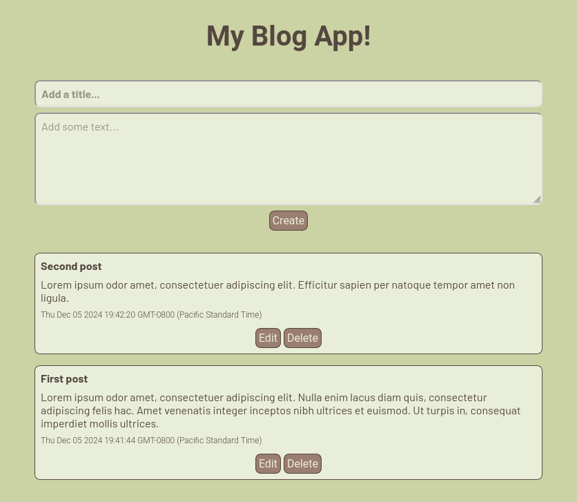

# My Blog App

## Overview

This is a simple blog app developed as part of a full-stack web development
bootcamp on [Udemy](https://www.udemy.com/). The backend was built with 
Node.js, Express, and EJS templates. The frontend was built with HTML and 
Sass. The app implements all of the CRUD operations: a user can create, read, update, and delete blog posts. In this version of the project, the blog posts do not persist between sessions.

### Screenshot



## Install

Clone the repo and then install the required packages with 

```bash
$ npm install
```

## Run

In the top-level directory of the project, run the app with

```bash
$ node app.js
```

Then, point the browser to `http://localhost:3000/`. From there, new blog posts can be created. Once created, blog posts can be edited or deleted.